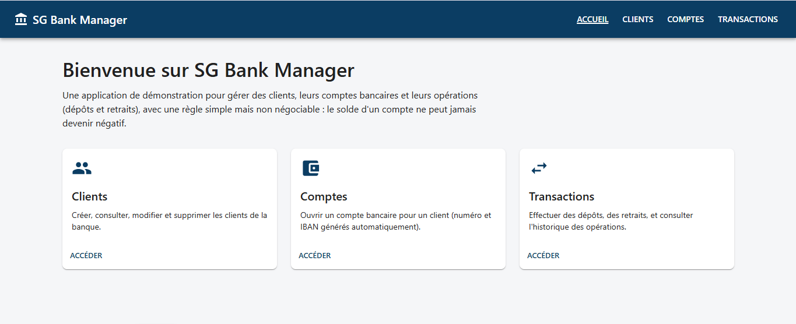
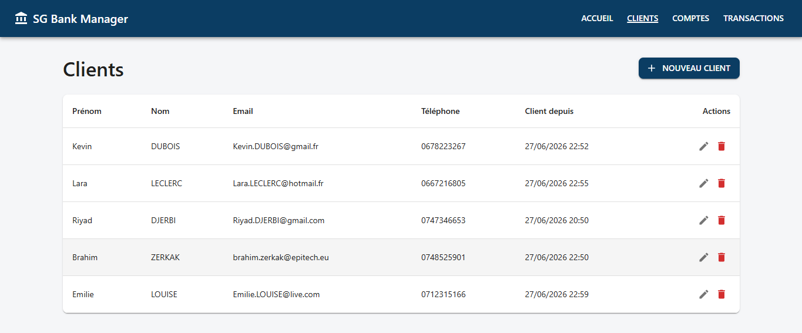
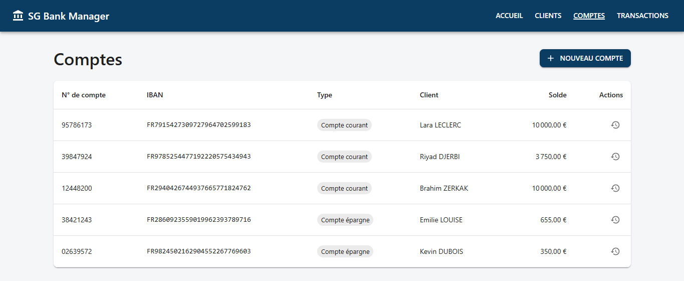
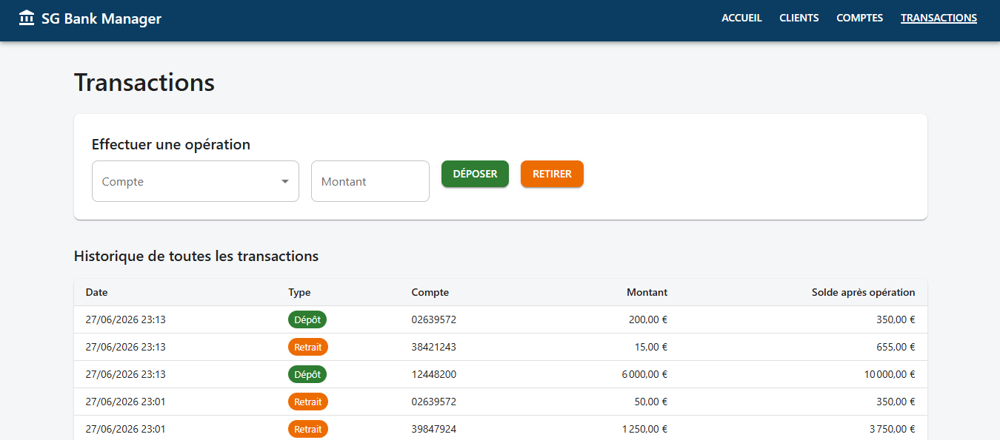
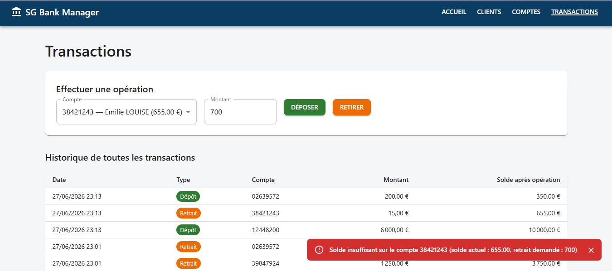
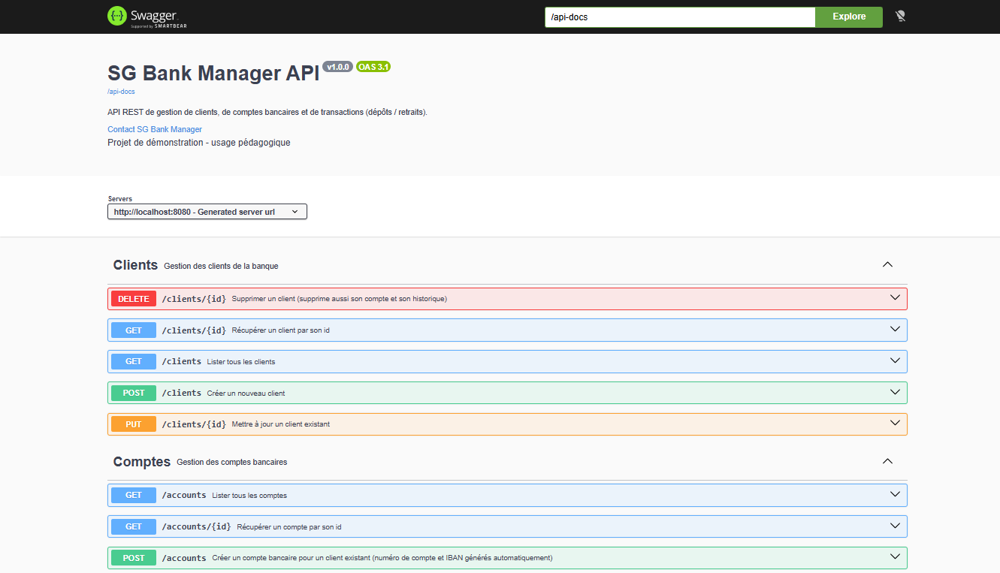

# SG Bank Manager

Mini-application bancaire full-stack (Spring Boot 3 / React 18) permettant de gérer des clients, leurs comptes bancaires et leurs opérations (dépôts, retraits), avec une règle métier centrale : **le solde d'un compte ne peut jamais devenir négatif**.

Projet réalisé en autonomie sur un week-end, dans le cadre de la préparation d'un entretien d'alternance Développeur Full Stack Java / React, avec l'objectif de produire un code structuré et documenté comme dans un environnement professionnel (architecture en couches, DTO/Mapper, gestion globale des erreurs, documentation OpenAPI).


---

## Sommaire

- [Aperçu](#aperçu)
- [Fonctionnalités](#fonctionnalités)
- [Stack technique](#stack-technique)
- [Architecture](#architecture)
- [API REST](#api-rest)
- [Installation](#installation)
- [Lancement](#lancement)
- [Choix techniques](#choix-techniques)
- [Limites connues et pistes d'amélioration](#limites-connues-et-pistes-damélioration)

---

## Aperçu

| Accueil | Clients |
|---|---|
|  |  |

| Comptes | Transactions |
|---|---|
|  |  |

| Gestion d'erreur métier (solde insuffisant) | Documentation API (Swagger) |
|---|---|
|  |  |

---

## Fonctionnalités

**Clients** — CRUD complet (création, lecture, modification, suppression), avec validation des champs (prénom/nom obligatoires, email valide et unique).

**Comptes bancaires** — Ouverture d'un compte pour un client existant (un client = un compte). Numéro de compte et IBAN générés automatiquement par le serveur.

**Transactions** — Dépôt et retrait, avec une règle non négociable : un retrait qui rendrait le solde négatif est refusé (HTTP 422). Historique complet, consultable globalement ou filtré par compte.

**Documentation** — API entièrement documentée et testable via Swagger UI, générée automatiquement à partir du code (springdoc-openapi).

---

## Stack technique

### Backend

| Techno | Rôle |
|---|---|
| Java 21 | Langage |
| Spring Boot 3.5 | Framework applicatif |
| Spring Data JPA / Hibernate | Persistance |
| PostgreSQL 16 | Base de données |
| Jakarta Validation | Validation des entrées |
| springdoc-openapi (Swagger) | Documentation API |
| Lombok | Réduction du code répétitif |
| Maven | Build |

### Frontend

| Techno | Rôle |
|---|---|
| React 18 | Librairie UI |
| TypeScript | Typage statique |
| Vite | Build tool / serveur de dev |
| React Router 7 | Routing |
| Axios | Client HTTP |
| MUI (Material UI) | Composants d'interface |

### Outils

- Git (historique de commits atomique et conventionnel)
- Docker Compose (PostgreSQL en conteneur)

---

## Architecture

### Backend — architecture en couches

```
backend/src/main/java/com/sgbankmanager/
├── config/        # Configuration (OpenAPI/Swagger)
├── controller/     # Endpoints REST - aucune logique métier
├── dto/            # Objets d'échange (Request/Response), jamais l'entité exposée
├── entity/         # Entités JPA (Client, Account, Transaction)
├── exception/      # Exceptions métier + gestionnaire global (@RestControllerAdvice)
├── mapper/         # Conversion Entity <-> DTO
├── repository/     # Spring Data JPA
└── service/        # Logique métier (règles, transactions, génération IBAN...)
```

Flux d'une requête : `Controller` (traduit HTTP <-> appel Java) → `Service` (logique métier, transactions) → `Repository` (accès données). Les erreurs levées par le service remontent automatiquement jusqu'au `GlobalExceptionHandler`, qui les traduit en réponse JSON avec le bon code HTTP — aucun `try/catch` dans les controllers.

### Frontend — architecture par responsabilité

```
frontend/src/
├── components/     # Composants réutilisables (Layout, Dialogs, Snackbar...)
├── pages/          # Une page par route (Accueil, Clients, Comptes, Transactions)
├── services/       # Appels Axios typés vers l'API REST
├── types/          # Types TypeScript, miroir exact des DTOs backend
├── hooks/          # Hooks custom (ex: useSnackbar)
└── utils/          # Thème MUI, formatage, extraction des erreurs API
```

---

## API REST

Documentation interactive complète disponible sur `/swagger-ui.html` une fois le backend lancé. Résumé :

| Méthode | Endpoint | Description |
|---|---|---|
| GET | `/clients` | Liste des clients |
| GET | `/clients/{id}` | Détail d'un client |
| POST | `/clients` | Créer un client |
| PUT | `/clients/{id}` | Modifier un client |
| DELETE | `/clients/{id}` | Supprimer un client (cascade sur son compte) |
| GET | `/accounts` | Liste des comptes |
| GET | `/accounts/{id}` | Détail d'un compte |
| POST | `/accounts` | Ouvrir un compte pour un client |
| GET | `/transactions` | Historique (optionnel : `?accountId=`) |
| POST | `/transactions/deposit` | Effectuer un dépôt |
| POST | `/transactions/withdraw` | Effectuer un retrait (422 si solde insuffisant) |

---

## Installation

### Prérequis

- [Java 21 (Temurin)](https://adoptium.net/)
- [Docker Desktop](https://www.docker.com/products/docker-desktop/)
- [Node.js LTS](https://nodejs.org/) (npm inclus)
- Un IDE Java avec support Maven (IntelliJ IDEA recommandé, Maven est embarqué)

### Cloner le projet

```bash
git clone <url-du-repo>
cd sg-bank-manager
```

---

## Lancement

### 1. Base de données

```bash
docker compose up -d
```

Démarre PostgreSQL 16 sur le port `5433` (mappé depuis le `5432` du conteneur, pour éviter tout conflit avec une éventuelle installation locale de PostgreSQL).

### 2. Backend

Ouvrir le dossier `backend/` dans un IDE Java (Maven est résolu automatiquement), puis lancer `SgBankManagerApplication`.

Ou en ligne de commande, avec Maven installé :
```bash
cd backend
mvn spring-boot:run
```

Le schéma de base de données (tables `clients`, `accounts`, `transactions`) est créé automatiquement par Hibernate au démarrage.

L'API est disponible sur `http://localhost:8080`, Swagger sur `http://localhost:8080/swagger-ui.html`.

### 3. Frontend

```bash
cd frontend
npm install
npm run dev
```

Application disponible sur `http://localhost:5173`. Le serveur de développement Vite redirige automatiquement les appels `/api/*` vers le backend (`http://localhost:8080`) — aucune configuration CORS n'est nécessaire en développement.

---

## Choix techniques

Quelques décisions volontairement assumées, qui peuvent être détaillées en entretien :

- **Relation Client ↔ Compte en `@OneToOne`** : le périmètre du projet définit qu'un client possède un seul compte. Dans une vraie banque, ce serait un `@OneToMany` pour permettre plusieurs comptes par client.
- **`BigDecimal` pour tous les montants**, jamais `double`/`float` : règle non négociable dès qu'on manipule de l'argent (erreurs d'arrondi en virgule flottante).
- **IBAN généré fictif mais de bonne longueur** (27 caractères, format `FR` + 25 chiffres) : un vrai IBAN s'appuie sur une clé de contrôle ISO 13616 (MOD-97), volontairement hors périmètre ici.
- **DTO systématiques, jamais l'entité JPA exposée** dans l'API : évite les soucis de lazy-loading hors transaction et les fuites de structure interne.
- **`@Transactional` avec dirty-checking** plutôt que des appels `.save()` explicites après modification d'une entité managée — comportement JPA standard, documenté en commentaire dans le code à chaque occurrence.
- **Proxy Vite → backend** plutôt que configuration CORS : choix de simplicité pour un environnement de développement local.
- **Mapping manuel (pas de MapStruct)** : plus simple à lire et à expliquer pour le volume de code de ce projet.

---

## Limites connues et pistes d'amélioration

Assumées consciemment, hors périmètre d'un projet réalisé sur un week-end :

- Pas de verrouillage optimiste/pessimiste sur `Account` : un accès concurrent (deux retraits simultanés sur le même compte) pourrait théoriquement créer une race condition. Solution réelle : `@Version` (verrou optimiste) ou `SELECT ... FOR UPDATE`.
- Pas de tests automatisés (unitaires/intégration).
- Pas de pagination sur les listes (acceptable au vu du volume de données d'un projet de démonstration).
- Pas d'authentification (volontairement exclu du périmètre initial).
- IBAN sans calcul de clé de contrôle réel (cf. section choix techniques).

---

## Auteur

Brahim Zerkak — projet réalisé dans le cadre d'une préparation d'entretien d'alternance Développeur Full Stack Java / React.
